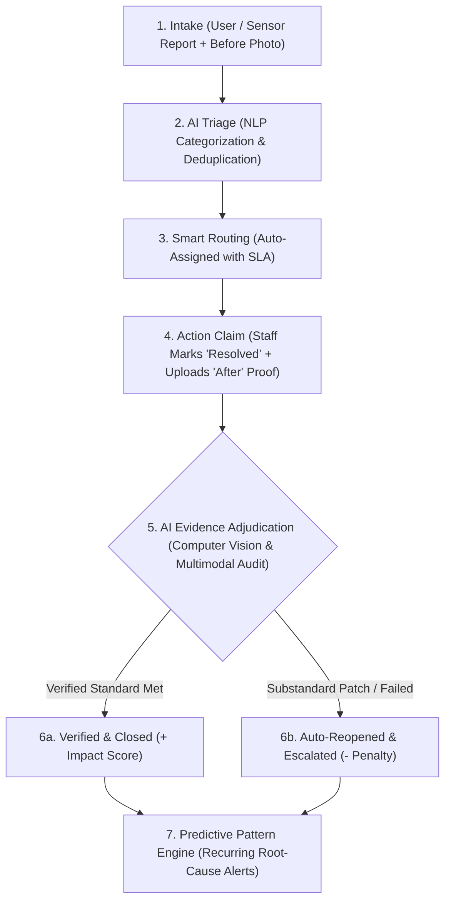

# 🚀 Proof of Impact (ImpactLoop AI)

<div align="center">

[](https://nextjs.org/)
[](https://www.typescriptlang.org/)
[](https://tailwindcss.com/)
[](https://www.mongodb.com/)
[](https://ai.google.dev/)
[](https://opensource.org/licenses/MIT)

**Closed-Loop AI-Powered Problem Resolution & Evidence Verification Platform**

*"A problem is not considered successfully solved just because it is marked 'Resolved' — the system verifies the resolution and measures its actual impact."*

[Features](#-key-features) • [Architecture](#-solution-the-accountability-loop) • [Quickstart](#-quickstart--installation) • [Database](#-mongodb-cloud-database) • [API Docs](#-api-endpoints) • [Testing Guide](#-interactive-walkthrough--testing-guide)

---

</div>

## 🌟 Executive Overview

**Proof of Impact (ImpactLoop AI)** is a next-generation accountability and operations management platform. Traditional ticketing systems (e.g., Jira, ServiceNow, municipal grievance portals) operate on a flawed assumption: once a technician or contractor clicks **"Resolved"**, the ticket is closed and counted as a success. This leads to **unverified claims, superficial temporary fixes, and recurring infrastructure breakdowns**.

Proof of Impact introduces **The Accountability Loop**: a closed-loop verification engine powered by Natural Language Processing (NLP), Computer Vision (CV), and Predictive Frequency Clustering. It mandates verifiable "After" evidence, runs automated visual and semantic adjudication, penalizes substandard or fraudulent closures, and aggregates systemic failure patterns before they cause widespread disruption.

---

## 🛑 Problem Statement

1. **The Deception of "Status: Closed"**:
   - Maintenance crews often apply quick, substandard patches (e.g., loose gravel in a pothole without bituminous asphalt, temporary tape over a leaking pipe) and mark tickets resolved.
   - Traditional dashboards show a false "100% resolution rate" while citizens/employees continue suffering from the same broken infrastructure.
2. **Redundant & Duplicate Dispatching**:
   - When a failure occurs (e.g., Wi-Fi outage or AC failure), dozens of users file tickets with different phrasing, causing chaotic redundant dispatches.
3. **Reactive vs. Proactive Maintenance**:
   - Failures that follow temporal or spatial patterns (e.g., "Lab 3 network drops every Monday morning under heavy class load") are treated as isolated incidents rather than systemic root causes.

---

## 💡 Solution: The Accountability Loop

Proof of Impact replaces the naive `Report → Assign → Resolve → Close` workflow with an evidence-based **6-Stage Closed Loop**:



---

## 🚀 Key Features & Innovations

- 🔍 **AI-Powered Evidence Adjudication**: Compares initial reported failure photos against post-repair photos using computer vision and multimodal reasoning.
- ❌ **Substandard Claim Rejection & Auto-Escalation**: Automatically rejects substandard repairs (e.g., uncompacted gravel, temporary tape, missing lux illumination) and reopens the ticket with penalty scoring.
- 📊 **True Impact Score vs. Traditional Inflated Metrics**: Department performance is scored on verified resolution rates and recurrence prevention, eliminating "fake closures".
- ⚡ **Real-Time Semantic Deduplication**: Flags and links duplicate or related complaints as users type in natural language.
- 🔄 **Predictive Frequency Clustering**: Discovers temporal cycles (e.g., Monday morning outages) and spatial hotspots, grouping them into master systemic work orders.
- 🏛️ **Multi-Domain Taxonomy**: Deployable across **Municipal Governance**, **University Campuses**, and **Enterprise Datacenters & Facilities**.
- 💬 **Generative Executive Intelligence**: Plain English operational query engine for city leaders, campus deans, and facility directors.

---

## 🛠️ Technology Stack

| Layer | Technologies |
| :--- | :--- |
| **Frontend** | Next.js 14, React 18, TypeScript, Tailwind CSS, Lucide React, Glassmorphism UI Engine |
| **Backend** | Next.js App Router API Routes & Server Handlers |
| **Database** | MongoDB Atlas (Cloud) with resilient offline JSON-ledger fallback |
| **AI / ML** | Google Gemini 1.5 Pro / Flash, OpenAI Vision, High-precision Local Fallback AI |
| **Testing** | Automated Python E2E Test Suite, Node.js API verification scripts |

---

## 🏛️ Domain Taxonomies Supported

| Domain | Example Failure Scenarios | Target Departments |
| :--- | :--- | :--- |
| 🎓 **University Campus** | Lab Wi-Fi packet drops, lecture fan bearing rattle, hostel water leaks | IT Infrastructure, Campus Maintenance, Electrical Works |
| 🏛️ **Civic Governance** | Road craters, broken streetlights, illegal dumps, storm drain blockages | Public Works Dept, Municipal Energy, Sanitation |
| 🏢 **Enterprise Facilities** | Data center HVAC condensation, RFID turnstile badge timeouts, fire safety | Facilities Management, Physical Security, IT Ops |

---

## ⚙️ Quickstart & Installation

### Prerequisites
- **Node.js**: v18.0.0 or later (v20+ recommended)
- **npm** or **yarn** / **pnpm**
- **Git**

### 1. Clone the Repository
```bash
git clone https://github.com/payalpawar1320-afk/AI-Automation-proof-of-impact-.git
cd AI-Automation-proof-of-impact-
```

### 2. Install Dependencies
```bash
npm install
```

### 3. Configure Environment Variables
Create a `.env.local` file by copying the template:
```bash
cp .env.example .env.local
```

Configure your environment variables in `.env.local`:
```env
# MongoDB Atlas Connection String (Optional - falls back to local JSON ledger if omitted)
MONGODB_URI="mongodb+srv://<username>:<password>@cluster0.1zwuaww.mongodb.net/proof_of_impact?retryWrites=true&w=majority"

# Optional: Gemini / OpenAI API Key for live multimodal reasoning
GEMINI_API_KEY="your_gemini_api_key_here"

# App Port
PORT=3000
```

### 4. Run Development Server
```bash
npm run dev
```

Open [http://localhost:3000](http://localhost:3000) in your browser to view the application.

---

## 🗄️ MongoDB Cloud Database

Proof of Impact includes native **MongoDB Atlas** integration with automated failover:

- **Collections**: `issues`, `departments`, `patterns`, `adjudications`
- **Resilient Fallback**: If MongoDB is not configured or offline, the app seamlessly uses its embedded local reactive database with zero downtime.
- **Seeding Data**: You can reset or seed demo data anytime by calling `/api/seed` or clicking **"Reset Database"** in the app.

---

## 🔌 API Endpoints

| Method | Endpoint | Description |
| :--- | :--- | :--- |
| `GET / POST` | `/api/issues` | Fetch all issues or submit a new problem report |
| `GET / PATCH` | `/api/issues/:id` | Retrieve or update ticket status / action claim |
| `POST` | `/api/ai/triage` | Real-time NLP entity extraction, categorization & duplicate detection |
| `POST` | `/api/ai/verify` | AI Evidence Adjudication (Multimodal Before vs After comparison) |
| `GET` | `/api/ai/patterns` | Recurring failure cluster detection and systemic analysis |
| `POST` | `/api/ai/query` | Generative Executive AI query assistant |
| `GET` | `/api/analytics/departments` | True Impact Scores and performance analytics |
| `POST` | `/api/seed` | Reset & reseed demo database records |
| `GET` | `/api/health` | Service health & database connectivity check |

---

## 🧪 Interactive Walkthrough & Testing Guide

1. **Explore the Live Dashboard**:
   - Use the **Domain Switcher** in the top navigation bar to toggle between **University Campus**, **Civic Governance**, and **Enterprise Facilities**.
   - Check the **Interactive 6-Stage Accountability Loop** stepper.
2. **Report a Problem with Live AI Triage**:
   - Click **"+ Report Problem"**.
   - Click one of the quick test presets (e.g. *"🕳️ 5th Ave Road Crater"* or *"🌐 Lab 3 Wi-Fi Outage"*).
   - Observe how the **Real-Time AI Triage Engine** extracts category, asset, location, priority, and checks for duplicates as you type.
3. **Experience Evidence Verification & Adjudication**:
   - Open ticket `CIVIC-201` (*"Dangerous deep pothole on 5th Avenue"*).
   - Use the **Interactive Before vs After Image Slider**.
   - Click **"Run AI Adjudication"** — notice how the AI rejects the contractor's uncompacted gravel patch, reopens the ticket, and docks the department's Impact Score!
   - Open ticket `CAMPUS-102` (*"Water leakage in Block B"*), run adjudication, and observe the **VERIFIED** approval and positive score increase.
4. **Inspect Recurring Threat Clusters**:
   - Navigate to the **"Recurring Threat Clusters"** tab.
   - Review systemic root-cause hypotheses and click **"Dispatch Work Order"**.
5. **Analyze Departmental Impact Scores**:
   - Navigate to the **"Departmental Impact Score"** tab to view verified vs claimed resolution rates and True Impact Scores.
6. **Query the Executive AI Assistant**:
   - Navigate to the **"Executive AI Assistant"** tab.
   - Click suggested chips like *"What are the biggest infrastructure problems this month?"* or type custom natural language queries.

---

## 📄 License

Distributed under the MIT License. See `LICENSE` for more information.
